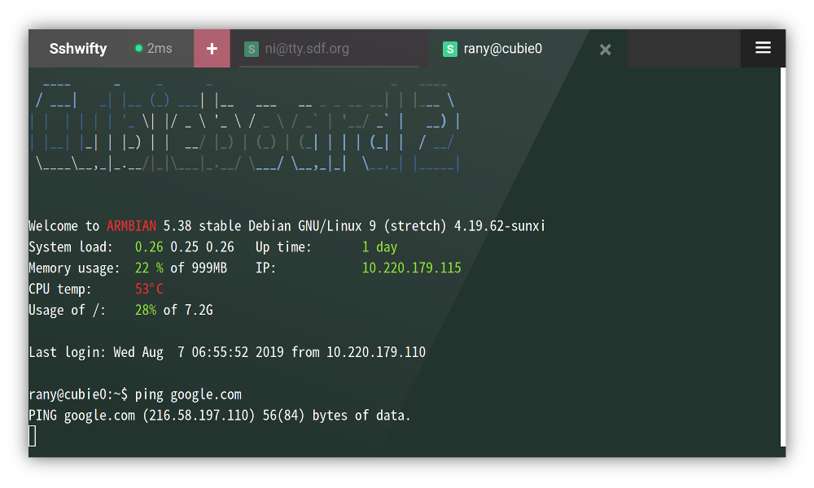

# Sshwifty Web SSH & Telnet Client
**Sshwifty是为Web制作的SSH和Telnet连接器。** 它可以部署在您的计算机或服务器上，为任何兼容（标准）的Web浏览器提供SSH和Telnet访问接口。




## 安装

### 二进制文件

编译好的二进制文件可以在页面的 [release] 部分找到。

请注意，这些二进制文件是由自动过程生成的，本项目的作者不会验证它们是否有效。您必须自行尝试风险。

### Docker 映像

如果您的计算机上安装了 Docker，您可以通过执行以下命令来使用我们预构建的 Docker 映像：

```
$ docker run --detach \
  --restart always \
  --publish 8182:8182 \
  --name sshwifty \
  niruix/sshwifty:latest
```

如果需要使用 TLS，但您不想设置 Docker 的值，则可以使用`SSHWIFTY_DOCKER_TLSCERT`和`SSHWIFTY_DOCKER_TLSCERTKEY` 环境变量将凭据文件导入容器并自动应用它们：

```
$ openssl req \
  -newkey rsa:4096 -nodes -keyout domain.key -x509 -days 90 -out domain.crt
$ docker run --detach \
  --restart always \
  --publish 8182:8182 \
  --env SSHWIFTY_DOCKER_TLSCERT="$(cat domain.crt)" \
  --env SSHWIFTY_DOCKER_TLSCERTKEY="$(cat domain.key)" \
  --name sshwifty \
  niruix/sshwifty:latest
```
`domain.crt`和`domain.key` 必须是位于将对其执行 `docker run` 命令的同一台计算机上的有效 TLS 证书和密钥文件。

从源代码编译（如果您是开发人员，则重新命令）
为了从源代码构建软件，需要以下工具：

git下载源代码
node并构建前端应用程序npm
go构建后端应用程序
要启动构建过程，请执行：

$ git clone https://github.com/nirui/sshwifty
$ cd sshwifty
$ npm install
$ npm run build
完成后，您可以在当前工作目录中找到新生成的二进制文件。sshwifty

注意：包含此软件的整个构建过程。当您遇到任何与编译/构建相关的问题时，请参阅它。Dockerfile

在云上部署
部署

要将此项目部署到云端，例如Google App Engine或Heroku，您需要先下载源代码，然后在部署之前在本地生成它。

npm run generate命令将生成所有静态文件，并自动调用将这些静态文件直接绑定到程序源代码中。您需要这些生成的源代码才能使软件正常运行。go generate ./...

尝试将未生成的代码直接部署到云中将导致失败，因为缺少所需的源代码。

另请记住，如果基于云部署过程，则可能必须修改文件才能上传所有必需的文件。git.gitignore

配置
Sshwifty 可以通过文件或环境变量进行配置。默认情况下，配置加载程序将首先尝试从默认路径加载文件，失败时，将使用环境变量。

您还可以通过在启动软件之前设置环境变量来指定自己的配置文件。例如：SSHWIFTY_CONFIG

$ SSHWIFTY_CONFIG=./sshwifty.conf.json ./sshwifty
这样，Sshwifty 将尝试从 文件 加载配置 ，并且永远不会访问其他环境变量。./sshwifty.conf.json

配置文件
以下是配置文件的所有选项：

{
  // HTTP Host. Keep it empty to accept request from all hosts, otherwise, only
  // specified host is allowed to access
  "HostName": "localhost",

  // Web interface access password. Set to empty to allow public access
  "SharedKey": "WEB_ACCESS_PASSWORD",

  // Remote dial timeout. This limits how long of time the backend can spend
  // to connect to a remote host. The max timeout will be determined by
  // server configuration (ReadTimeout).
  // (In Seconds)
  "DialTimeout": 10,

  // Socks5 proxy. When set, Sshwifty backend will try to connect remote through
  // the given proxy
  "Socks5": "localhost:1080",

  // Username of the Socks5 server. Please set when needed
  "Socks5User": "",

  // Password of the Socks5 server. Please set when needed
  "Socks5Password": "",

  // Sshwifty HTTP server, you can set multiple ones to serve on different
  // ports
  "Servers": [
    {
      // Which local network interface this server will be listening
      "ListenInterface": "0.0.0.0",

      // Which local network port this server will be listening
      "ListenPort": 8182,

      // Timeout of initial request. HTTP handshake must be finished within
      // this time
      // (In Seconds)
      "InitialTimeout": 3,

      // How long do the connection can stay in idle before the backend server
      // disconnects the client
      // (In Seconds)
      "ReadTimeout": 60,

      // How long the server will wait until the client connection is ready to
      // recieve new data. If this timeout is exceed, the connection will be
      // closed.
      // (In Seconds)
      "WriteTimeout": 60,

      // The interval between internal echo requests
      // (In Seconds)
      "HeartbeatTimeout": 20,

      // Forced delay between each request
      // (In Milliseconds)
      "ReadDelay": 10,

      // Forced delay between each write
      // (In Milliseconds)
      "WriteDelay": 10,

      // Path to TLS certificate file. Set empty to use HTTP
      "TLSCertificateFile": "",

      // Path to TLS certificate key file. Set empty to use HTTP
      "TLSCertificateKeyFile": ""
    },
    {
      "ListenInterface": "0.0.0.0",
      "ListenPort": 8182,
      "InitialTimeout": 3,
      .....
    }
  ],

  // Remote Presets, the operater can define few presets for user so the user
  // won't have to manually fill-in all the form fields
  //
  // Presets will be displayed in the "Known remotes" tab on the Connector
  // window
  //
  // Notice: You can use the same JSON value for `SSHWIFTY_PRESETS` if you are
  //         configuring your Sshwifty through enviroment variables.
  //
  // Warning: Presets Data will be sent to user client WITHOUT any protection.
  //          DO NOT add any secret information into Preset.
  //
  "Presets": [
    {
      // Title of the preset
      "Title": "SDF.org Unix Shell",

      // Preset Types, i.e. Telnet, and SSH
      "Type": "SSH",

      // Target address and port
      "Host": "sdf.org:22",

      // Form fields and values, you have to manually validate the correctness
      // of the field value
      //
      // Defining a Meta field will prevent user from changing it on their
      // Connector Wizard. If you want to allow users to use their own settings,
      // leave the field unsetted
      //
      // Values in Meta are scheme enabled, and supports following scheme
      // prefixes:
      // - "literal://": Text literal (Default)
      //                 Example: literal://Data value
      //                          (The final value will be "Data value")
      //                 Example: literal://file:///tmp/afile
      //                          (The final value will be "file:///tmp/afile")
      // - "file://": Load Meta value from given file.
      //              Example: file:///home/user/.ssh/private_key
      //                       (The file path is /home/user/.ssh/private_key)
      // - "environment://": Load Meta value from an Environment Variable.
      //                    Example: environment://PRIVATE_KEY_DATA
      //                    (The name of the target environment variable is
      //                    PRIVATE_KEY_DATA)
      //
      // All data in Meta is loaded during start up, and will not be updated
      // even the source already been modified.
      //
      "Meta": {
        // Data for predefined User field
        "User": "pre-defined-username",

        // Data for predefined Encoding field. Valid data is those displayed on
        // the page
        "Encoding": "pre-defined-encoding",

        // Data for predefined Password field
        "Password": "pre-defined-password",

        // Data for predefined Private Key field, should contains the content
        // of a Key file
        "Private Key": "file:///home/user/.ssh/private_key",

        // Data for predefined Authentication field. Valid values is what
        // displayed on the page (Password, Private Key, None)
        "Authentication": "Password",

        // Data for server public key fingerprint. You can acquire the value of
        // the fingerprint by manually connect to a new SSH host with Sshwifty,
        // the fingerprint will be displayed on the Fingerprint comformation
        // page.
        "Fingerprint": "SHA256:bgO...."
      }
    },
    {
      "Title": "Endpoint Telnet",
      "Type": "Telnet",
      "Host": "endpoint.vaguly.com:23",
      "Meta": {
        // Data for predefined Encoding field. Valid data is those displayed on
        // the page
        "Encoding": "utf-8"
        ....
      }
    },
    ....
  ],

  // Allow the Preset Remotes only, and refuse to connect to any other remote
  // host
  //
  // NOTICE: You can only configure OnlyAllowPresetRemotes through a config
  //         file. This option is not supported when you are configuring with
  //         environment variables
  OnlyAllowPresetRemotes: false
}
sshwifty.conf.example.json是有效配置文件的示例。

环境变量
有效的环境变量包括：

SSHWIFTY_HOSTNAME
SSHWIFTY_SHAREDKEY
SSHWIFTY_DIALTIMEOUT
SSHWIFTY_SOCKS5
SSHWIFTY_SOCKS5_USER
SSHWIFTY_SOCKS5_PASSWORD
SSHWIFTY_LISTENPORT
SSHWIFTY_INITIALTIMEOUT
SSHWIFTY_READTIMEOUT
SSHWIFTY_WRITETIMEOUT
SSHWIFTY_HEARTBEATTIMEOUT
SSHWIFTY_READDELAY
SSHWIFTY_WRITEELAY
SSHWIFTY_LISTENINTERFACE
SSHWIFTY_TLSCERTIFICATEFILE
SSHWIFTY_TLSCERTIFICATEKEYFILE
SSHWIFTY_PRESETS
SSHWIFTY_ONLYALLOWPRESETREMOTES
它们表示的选项与配置文件中的对应选项相对应。

注意：当您使用环境变量配置 Sshwifty 时，只允许使用一个 Sshwifty HTTP 服务器。无法在此配置方法下设置多个服务器。如果需要在多个端口上提供服务，请改用配置文件。

请注意：以下环境变量中的无效值将导致该值在配置解析阶段被轻量重置为默认值，而不会发出警告：

SSHWIFTY_DIALTIMEOUT
SSHWIFTY_INITIALTIMEOUT
SSHWIFTY_READTIMEOUT
SSHWIFTY_WRITETIMEOUT
SSHWIFTY_HEARTBEATTIMEOUT
SSHWIFTY_READDELAY
SSHWIFTY_WRITEELAY
常见问题
为什么软件上写着"时差超出了操作极限"？
当客户端和/或服务器上的时钟未同步超出容限时，通常会发生这种情况。

请确保客户端和服务器上的时钟时间正确，方法是将它们与 NTP 服务器重新同步，然后重新加载页面。问题应该在之后消失。

为什么我收到错误"类型错误：无法读取未定义的属性'importKey'"
这通常是因为您的Web浏览器不支持WebCrypt API，或者支持已被禁用。

如果您使用的是谷歌浏览器，请将Sshwifty与HTTPS连接。当连接不安全时，Chrome将禁用WebCrypt和许多其他API。

我可以在以下子路径下为Sshwifty服务吗？https://my.domain/ssh
短篇小说不行。Sshwifty的设计基于一个假设，即它将作为给定主机名下的唯一服务运行，允许Web浏览器更好地执行其数据隔离规则。这非常重要，因为Sshwifty在本地保存用户数据。

但是，如果您真的想将Sshwifty放入子路径中，则可以利用Sshwifty后端接口和资产始终位于URL前缀下的事实来执行此操作。因此，您可以将这些请求重定向或代理到其新位置。/sshwifty

请记住，这样做真的很麻烦，作者不建议这样做，因此如果您决定这样做，则不会提供支持。

为什么我无法将自己的组合键添加到控制台工具栏？
预定义的组合键主要是为了使移动操作成为可能，以及解决一些热键冲突。但是，如果效率是您的第一目标，请考虑使用专为终端设计的软件/屏幕键盘。

如果这还不够，通过蓝牙或OTA连接物理键盘可能是更好的选择。通过这种方式，您可以像使用计算机控制台一样键入内容。

学分
感谢Ryan Fortner的语法修复
许可证
该项目的代码在AGPL下获得许可，有关详细信息，请参阅 LICENSE.md。

本项目使用的第三方组件根据其各自的许可证进行许可。请参阅 DEPENDENCIES.md 以了解有关此项目使用的依赖项的更多信息，并阅读其版权声明。

贡献
这是一个业余爱好者项目，这意味着我没有太多时间投入其中。不好意思。

发布后（然后您可以读取此文件），此项目将进入维护状态，其中包括执行错误修复和安全更新。但是，添加新功能不是该州的一部分。

请不要发送任何拉取请求。如果您需要新功能，请分叉它，自己添加它，并像您自己的项目一样维护它。

（注意：拼写错误，语法错误或无效使用源代码和文档中的语言被归类为错误，如果您发现任何错误，请报告它们。谢谢！

感谢您的帮助！

享受！
